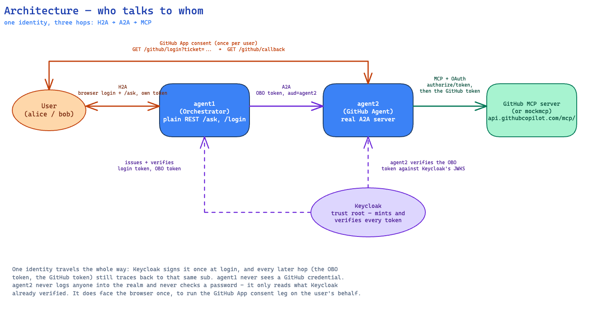
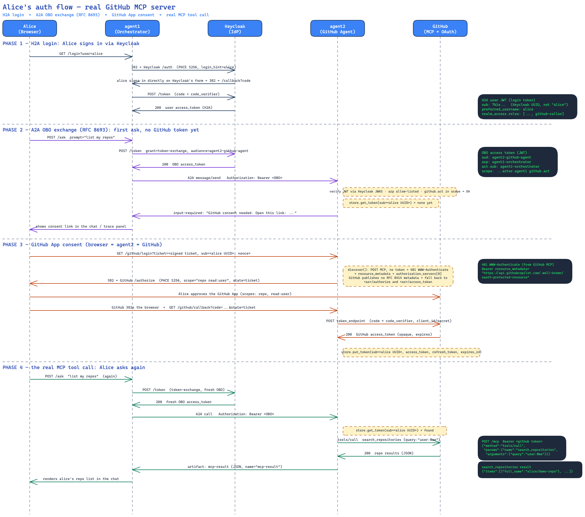
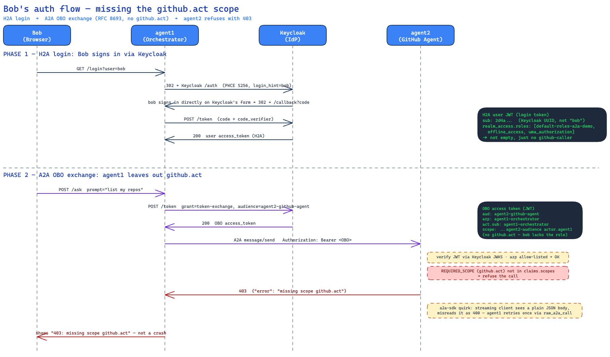

# A2A Auth Demo

See how one end-user identity travels through three legs:

1. **H2A** - a person logs in and talks to agent1 (the orchestrator).
2. **A2A** - agent1 calls agent2 (the GitHub agent) on behalf of that person.
3. **MCP** - agent2 calls an MCP server with that person's own GitHub token.

Production would put Okta plus TrueFoundry in front of this. The demo removes
that gateway so you see the raw protocol. Everything runs in local Docker
containers. No cloud, no Terraform, no AWS.

## Architecture: who talks to whom



Four services and one identity. Keycloak is the trust root: it mints every
token and every hop verifies against its JWKS. Note the arc across the top -
the browser talks straight to agent2 once, for the GitHub App consent leg.
That is the only time agent2 faces the user, and even then it never checks a
password. Source: `diagrams/architecture-overview.excalidraw`.

## Run it

```bash
cd a2a-auth-demo
cp .env.example .env
docker compose up --build
```

Four containers start: `keycloak`, `agent1`, `agent2`, `mockmcp`.
Wait until Keycloak logs `Running the server`.

Then:

1. Open http://localhost:9001
2. Pick `alice` in the dropdown (the default) and click **Login**. Sign in as
   `alice` / `alice`. The button becomes **Logout (alice)** once you are in,
   and the page shows `(has github.act)` next to her name.
3. Type `list my repos` and click **Ask agent1**.
4. The first ask shows a **GitHub consent** link (agent2 has no GitHub token for
   alice yet). Open the link, approve, close the tab.
5. Ask again. The **token trace** panel keeps a row for every step so far -
   login, then each ask:
   - the user token (H2A)
   - the OBO token (A2A) with `aud=agent2-github-agent` and an actor
     naming agent1
   - the GitHub token used at the MCP server
   Click **Clear token trace** to empty the panel and start over.
6. **Now try bob.** Click **Logout**, pick `bob` in the dropdown, sign in as
   `bob` / `bob` - the page shows `(no github.act)`. Ask the same question: it
   comes back a plain `403`, not a crash. See
   ["Is this user allowed to?"](#three-questions-kept-apart) below for why.

   Logout matters here for a reason worth noticing: Keycloak keeps its own
   SSO session in the browser, separate from agent1's. `/logout` is a real
   redirect to Keycloak's own logout endpoint, not just a local "forget the
   token" - clearing only agent1's side would leave Keycloak's session alive,
   and the next login would silently hand back whichever user was already
   signed in there, no matter who you picked in the dropdown.
7. **Agent cards**: the two links under "Break it" open agent1's and agent2's
   AgentCard JSON in a new tab. Agent2's is a real A2A card (`securitySchemes`,
   `skills`). Agent1's is a plain JSON doc for comparison - agent1 is not an
   A2A server in this demo, its `/ask` endpoint is plain REST.

## Sequence diagram: alice's auth flow



The four phases: alice's H2A login, the A2A OBO exchange (`RFC 8693`), the
GitHub App consent (only needed once), and the real MCP tool call. The dark
boxes show real data - actual JWT claims, the actual `WWW-Authenticate`
header, the actual MCP `tools/call` body. Source: `diagrams/alice-github-auth-flow.excalidraw`.

Two details the diagram is deliberate about. The `sub` is a Keycloak UUID, not
the string `alice` - the username lives in `preferred_username`, and everything
downstream (the signed ticket, the token store) keys off the UUID. And GitHub's
authorization server publishes no RFC 8414 metadata at the well-known path, so
`mcp_client.discover()` falls back to `<as>/authorize` and `<as>/access_token`
(see the comment in `agent2/mcp_client.py`).

## Sequence diagram: bob's auth flow



The same two opening phases, ending in a `403` instead of a tool call. Bob is a
real, correctly identified user with a valid OBO token - `aud`, `azp` and `act`
all check out. He is missing exactly one thing, `github.act` in `scope`, because
agent1 never asked for it. His `realm_access.roles` is not empty, which is the
point: this is authorisation failing on its own, not identity.
Source: `diagrams/bob-auth-flow.excalidraw`.

## Headless check

```bash
bash scripts/smoke.sh
```

It runs the whole chain with curl and exits non-zero on any bad hop.
It uses the password grant as a shortcut for the browser login.

Decode any token by hand:

```bash
python3 scripts/decode.py <token>
```

## What to look at

| file | what it teaches |
|------|-----------------|
| `keycloak/realm-export.json` | the clients, scopes and mappers, no console clicking |
| `agent1/exchange.py` | the RFC 8693 token exchange call |
| `agent2/auth.py` | the middleware that checks caller and reads the user identity |
| `agent2/agent_card.py` | the card states the auth need; the middleware enforces it |
| `agent2/github_oauth.py` | the signed ticket that carries identity into the browser leg |
| `agent2/mcp_client.py` | one MCP code path: 401 -> discovery -> PKCE -> token -> tool call |

## Three questions, kept apart

**Is this really agent1?** Three layers, all needed:

1. Keycloak only mints the OBO token for a confidential client that holds
   `AGENT1_SECRET`.
2. The token `aud` is `agent2-github-agent`, so a raw user token is refused.
3. Agent2's own allowlist on `azp` (`ALLOWED_CALLERS`). Audience alone is not
   enough, because another Keycloak client could get a token with that audience.
   The allowlist is the check that refuses an unknown agent.

**Is this really alice?** Agent2 never logs the user in. It reads `sub` out of a
token that Keycloak signed and that agent2 verifies against Keycloak's JWKS.
Agent1 cannot forge it. Identity and actor travel together in one token, and the
receiver trusts the IdP, not the caller.

**Is this user allowed to?** A third, separate question from the two above -
alice and bob are both real, both correctly identified, but only alice may use
agent2's GitHub function. Try it: log in as `bob` / `bob` and ask something.

The realm has two users. Alice has the realm role `github-caller`. Bob does not.
Keycloak does **not** gate an optional client scope by role on its own - if
agent1 asked for `github.act` on bob's behalf, Keycloak would hand it over just
as readily as it does for alice, because optional client scopes are a
client-level grant, not a per-user one. So the decision has to be made by
agent1, before it asks: `exchange.py` checks the logged-in user's own
`realm_access.roles` for `github-caller` and only puts `github.act` in the
`scope` it requests when that role is present (see
`exchange.has_github_caller_role()`).

To keep that decision testable in isolation, the audience (`aud`, "who this
token is for") is no longer tied to the `github.act` scope. It now comes from
its own `agent2-audience` scope, requested for every user. So bob's OBO token
still has `aud=agent2-github-agent` and passes agent1's own allowlist and the
signature/audience checks - it is missing exactly one thing, `github.act` in
`scope`, and agent2's middleware rejects it for exactly that reason:

```
if REQUIRED_SCOPE not in claims.scopes:
    return JSONResponse({"error": f"missing scope {REQUIRED_SCOPE}"}, status_code=403)
```

That check existed from the start but was never actually exercised, because
every user got the scope. It is real now.

One `a2a-sdk` quirk this ran into: the client is configured for streaming, and
its streaming transport checks the response's `Content-Type` before it checks
the HTTP status code. Agent2's plain JSON `403` body doesn't look like an SSE
stream to it, so the error the SDK raises is a made-up `400` "not an SSE
response" client error, not agent2's real `403`. Agent1 does not show that to
the user: on any such SDK error it reissues the same call as one plain HTTP
request (`a2a_client.raw_a2a_call`, the same path the break-it buttons use)
and reports agent2's actual status and body instead. What the browser and the
trace panel see is the real thing: `403 {"error":"missing scope github.act"}`.

## The `act` claim (honest note)

Keycloak's standard token exchange does **not** put an `act` claim on the new
token by itself. In this demo the `act` claim is added by a **hardcoded-claim
mapper** on the `actor.agent1` client scope, which only agent1 has. See
`keycloak/realm-export.json`. The actor is also provable from `azp` (the client
that asked for the token). The middleware accepts either `azp` or `act.sub`
against `ALLOWED_CALLERS`.

## Break it

The web page has five buttons. Each forces one failure:

| button | what it sends | expected |
|--------|---------------|----------|
| wrong aud | token signed by the wrong key, wrong audience | 401 |
| raw user token | the login token, not the OBO token | 401 (aud) |
| expired token | a token with `exp` in the past | 401 |
| no token | no Authorization header | 401 + `WWW-Authenticate` |
| unlisted client | a real Keycloak token with `azp=rogue-agent` | 403 (allowlist) |

## Leg 3: mock or real GitHub

`MCP_MODE=mock` (default) uses `mockmcp`. It copies the real shape: 401 with
`WWW-Authenticate`, discovery documents, authorize plus token with PKCE, and
canned repo and issue data. No network needed.

`MCP_MODE=github` points at `https://api.githubcopilot.com/mcp/`. You must
pre-register a **GitHub App** (tokens expire, unlike an OAuth App) with callback
`http://localhost:9002/github/callback`, then set `GITHUB_APP_CLIENT_ID` and
`GITHUB_APP_CLIENT_SECRET` in `.env`. Agent2 discovers the authorization server
from the `WWW-Authenticate` header, it does not hardcode a GitHub URL. Because
both modes speak the same dance, `mcp_client.py` has one code path. The real
GitHub path is optional proof and is less exercised than the mock path.

## Where this demo simplifies (read this)

- Secrets live in `.env` and the realm export in plain text. Not for production.
- `SESSION_SECRET` and `AGENT2_TICKET_KEY` are dev signing keys.
- The Keycloak realm has `sslRequired: none` and a fixed HTTP issuer
  (`http://localhost:8081`) so tokens read the same from the browser and from
  the containers.
- `agent1-orchestrator` also has the password grant on, only so `smoke.sh` can
  skip the browser. The teaching flow uses authorization code plus PKCE.
- `rogue-agent` exists only to power the "unlisted client" button.
- No push notifications, no LLM, no production secret handling.
- Keycloak has no volume. Its realm and signing keys are ephemeral - every
  `docker compose down` (with or without `-v`) followed by `up` starts a
  fresh Keycloak that re-imports `realm-export.json` from scratch.
- Whether bob gets `github.act` is decided by agent1's own code
  (`exchange.has_github_caller_role`), not enforced by Keycloak itself.
  Keycloak will hand out an optional client scope to any user a client asks
  on behalf of - see "Is this user allowed to?" above. A production setup
  would more likely use Keycloak's own Authorization Services (a
  "token-exchange" permission on the target client) so the IdP refuses the
  exchange outright, rather than trusting agent1 to ask nicely.

## Troubleshooting: "token exchange failed" / 502 on Ask

If the log shows Keycloak's `TOKEN_EXCHANGE_ERROR` with
`reason="subject_token validation failure"`, your cached login token went
stale before you clicked Ask - usually because the access token simply
expired (`accessTokenLifespan` in the realm, 30 minutes by default) while
you were doing something else between login and asking, such as setting up
a GitHub App. It is not specific to `MCP_MODE=github`; it happens on the
very first hop, before agent2 or MCP are ever called. Log out, log back in,
and ask right away. Agent1 now returns a plain 401 with that explanation
instead of a raw 502, and clears the stale session so the page's button
flips back to "Login as alice" on its own.

If you changed `keycloak/realm-export.json` (for example, to raise
`accessTokenLifespan` further), Keycloak only re-reads it on a fresh
import: recreate the `keycloak` container (`docker compose up -d --force-recreate keycloak`,
or a full `down` + `up`) for the change to take effect.

## Keycloak field name

The client attribute that turns on standard token exchange is
`standard.token.exchange.enabled: "true"` on `agent1-orchestrator`
(Keycloak 26). Public clients cannot do standard token exchange, so agent1 is
confidential even though it also runs the browser login.
